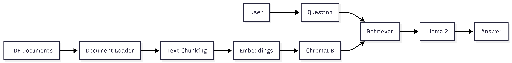

<p align="center">
  
</p>

<h1 align="center">KnowledgeForge AI</h1>

<p align="center">
Enterprise Retrieval-Augmented Generation Platform
</p>

<p align="center">


</p>

<p align="center">
Transforming enterprise documents into intelligent, searchable knowledge systems using semantic retrieval and large language models.
</p>

---

# Overview

KnowledgeForge AI is an enterprise Retrieval-Augmented Generation (RAG) platform designed to enable intelligent document search, semantic retrieval, and context-aware answer generation.

The system combines modern information retrieval techniques with transformer-based language models to deliver accurate responses grounded in uploaded knowledge sources.

Unlike traditional keyword search systems, KnowledgeForge AI understands semantic meaning, retrieves relevant document context using vector similarity search, and generates human-readable answers using advanced language models.

---

# Why KnowledgeForge AI?

Organizations generate massive amounts of unstructured information in the form of:

* Technical Documentation
* Standard Operating Procedures
* Research Papers
* Internal Knowledge Bases
* Policy Documents
* Product Manuals

Traditional search solutions rely on keyword matching and often fail to understand intent or context.

KnowledgeForge AI solves this problem through:

* Semantic Understanding
* Vector-Based Retrieval
* Context-Aware Generation
* Enterprise Knowledge Discovery
* AI-Powered Question Answering

---

# Key Features

* Retrieval-Augmented Generation (RAG)
* Semantic Document Search
* PDF Knowledge Base Ingestion
* FAISS Vector Indexing
* Sentence Transformer Embeddings
* Transformer-Based Response Generation
* User Authentication and Authorization
* Enterprise Knowledge Management
* Context-Aware Answer Generation
* Scalable Document Retrieval Pipeline

---

# Product Demo

<p align="center">
  <video src="assets/demo.mp4" controls width="90%"></video>
</p>

---

# Architecture

<p align="center">
  
</p>

KnowledgeForge AI follows a layered architecture consisting of:

1. Document Ingestion Layer
2. Embedding Generation Layer
3. Vector Search Layer
4. Retrieval Layer
5. Prompt Construction Layer
6. Language Model Inference Layer
7. Response Generation Layer

---

# Workflow

<p align="center">
  
</p>

The workflow follows:

```text
User Uploads PDF
        ↓
Text Extraction
        ↓
Document Chunking
        ↓
Embedding Generation
        ↓
FAISS Index Creation
        ↓
User Query
        ↓
Semantic Retrieval
        ↓
Context Construction
        ↓
Language Model Generation
        ↓
Answer Delivery
```

---

# Technology Stack

| Layer                | Technology            |
| -------------------- | --------------------- |
| Frontend             | HTML, CSS             |
| Backend              | Django 2.1.7          |
| Programming Language | Python                |
| Machine Learning     | PyTorch               |
| NLP Framework        | Transformers          |
| Embeddings           | Sentence Transformers |
| Vector Search        | FAISS                 |
| Database             | MySQL                 |
| Cloud Integration    | AWS (Boto3)           |
| Data Processing      | NumPy, Datasets       |

---

# Repository Structure

```text
KnowledgeForge-AI/

├── README.md
├── LICENSE
├── requirements.txt
├── manage.py
│
├── Rag/
│   ├── settings.py
│   ├── urls.py
│   └── wsgi.py
│
├── RagApp/
│   ├── models.py
│   ├── views.py
│   ├── urls.py
│   ├── admin.py
│   ├── templates/
│   └── static/
│
├── assets/
│   ├── hero-banner.png
│   ├── architecture-dark.png
│   ├── workflow-dark.png
│   └── demo.mp4
│
├── screenshots/
│
└── docs/
    ├── Architecture.md
    ├── SystemDesign.md
    ├── DeploymentGuide.md
    └── API.md
```

---

# Screenshots

## Home Page


---

## User Registration


---

## User Authentication


---

## Document Upload


---

## Semantic Retrieval


---

## Answer Generation


---

# Installation

```bash
git clone https://github.com/Ashrith-3108/KnowledgeForge-AI.git

cd KnowledgeForge-AI

python -m venv venv

# Windows
venv\Scripts\activate

pip install -r requirements.txt

python manage.py migrate

python manage.py runserver
```

---

# Documentation

* docs/Architecture.md
* docs/SystemDesign.md
* docs/DeploymentGuide.md
* docs/API.md

---

# Future Roadmap

### Phase 1

* Document Upload
* Semantic Retrieval
* Answer Generation

### Phase 2

* Multi-User Workspaces
* Role-Based Access Control
* REST APIs

### Phase 3

* Docker Deployment
* Kubernetes Support
* CI/CD Pipelines
* Monitoring & Observability

### Phase 4

* Multi-Agent RAG
* Knowledge Graph Integration
* Real-Time Streaming Ingestion

---

# Author

## Ashrith Vavillapally

AI Engineer • Data Engineer • Software Developer

**GitHub**
https://github.com/Ashrith-3108

**LinkedIn**
https://www.linkedin.com/in/vavillapally-ashrith-9823482a1/

**Email**
[vavillapallyashrith@gmail.com](mailto:vavillapallyashrith@gmail.com)

---

# License

This project is licensed under the MIT License.

---

<p align="center">
Built with ❤️ using Django, FAISS, Transformers and modern Retrieval-Augmented Generation techniques.
</p>
