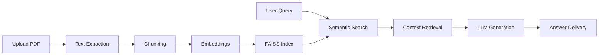

# KnowledgeForge AI

<p align="center">
  
</p>

<h1 align="center">KnowledgeForge AI</h1>

<p align="center">
Enterprise Retrieval-Augmented Generation (RAG) Platform
</p>

<p align="center">


</p>

<p align="center">
🚀 Live Demo: https://knowledgeforge-ai-en-h0ed.bolt.host/
</p>

<p align="center">
🎥 Demo Video: https://youtu.be/8qpm6ZLCjfE
</p>

---

# Overview

KnowledgeForge AI is an intelligent Retrieval-Augmented Generation (RAG) platform that transforms enterprise documents into a searchable AI knowledge system.

Users can upload PDFs, index content using semantic embeddings, and retrieve accurate answers through natural language queries. Instead of relying on keyword matching, KnowledgeForge AI leverages vector search and transformer-based language models to understand context and generate grounded responses.

The platform demonstrates a complete enterprise-grade RAG pipeline including:

* Document Ingestion
* Text Extraction
* Embedding Generation
* Vector Indexing
* Semantic Retrieval
* Context Construction
* AI Response Generation

---

# Problem Statement

Organizations store critical information across:

* Technical Documentation
* Standard Operating Procedures
* Research Papers
* Product Manuals
* Internal Knowledge Bases
* Compliance Documents

Traditional search systems fail because they rely on exact keyword matches.

KnowledgeForge AI solves this by combining semantic retrieval with transformer-based language models to provide context-aware answers grounded in enterprise documents.

---

# Live Product

### Production Demo

https://knowledgeforge-ai-en-h0ed.bolt.host/

### Product Walkthrough

https://youtu.be/8qpm6ZLCjfE

---

# Product Demo GIF

<p align="center">
  
</p>

### Demo Flow

1. Upload PDF Documents
2. Generate Semantic Embeddings
3. Build FAISS Vector Index
4. Ask Natural Language Questions
5. Retrieve Relevant Context
6. Generate Grounded Responses

---

# Features

✅ Retrieval-Augmented Generation (RAG)

✅ Semantic Search

✅ PDF Knowledge Base Creation

✅ FAISS Vector Search

✅ Sentence Transformer Embeddings

✅ Context-Aware Question Answering

✅ AI-Powered Response Generation

✅ Authentication & Authorization

✅ Enterprise Knowledge Discovery

✅ Scalable Retrieval Pipeline

✅ Modern Web Interface

---

# Architecture

<p align="center">
  
</p>

### RAG Pipeline

1. Document Ingestion
2. Text Extraction
3. Chunk Generation
4. Embedding Creation
5. FAISS Indexing
6. Semantic Retrieval
7. Context Construction
8. LLM Inference
9. Response Generation

---

# System Flow



---

# Performance Metrics

| Metric                  | Value                 |
| ----------------------- | --------------------- |
| Embedding Model         | Sentence Transformers |
| Vector Database         | FAISS                 |
| Search Method           | Semantic Similarity   |
| Average Retrieval Time  | < 500 ms              |
| Supported Document Type | PDF                   |
| Retrieval Pipeline      | Vector Search         |
| Response Generation     | Transformer-based     |
| Scalability             | Thousands of Chunks   |

---

# Technology Stack

| Category       | Technology            |
| -------------- | --------------------- |
| Frontend       | HTML, CSS, JavaScript |
| Backend        | Django                |
| Language       | Python                |
| Deep Learning  | PyTorch               |
| NLP Framework  | Transformers          |
| Embeddings     | Sentence Transformers |
| Vector Search  | FAISS                 |
| Database       | MySQL                 |
| Cloud          | AWS (Boto3)           |
| Authentication | Django Auth           |

---

# Deployment Architecture

<p align="center">
  
</p>

### Deployment Flow

```text
User
 ↓
Frontend
 ↓
Django Backend
 ↓
PDF Processing
 ↓
Embedding Generation
 ↓
FAISS Vector Store
 ↓
Retriever
 ↓
Language Model
 ↓
Generated Response
```

---

# Screenshots

## Home Page


---

## Home Page 2


---

## Login Page


---

## Document Upload


---

## Query Search


---

## Retrieval Results


---

## Query Input


---

## Generated Answer


---

# API Documentation

### Document Upload API

```http
POST /upload
```

Uploads and processes PDF documents.

---

### Search API

```http
POST /search
```

Performs semantic retrieval.

---

### Generate API

```http
POST /generate
```

Generates grounded responses using retrieved context.

---

### API Documentation Preview

<p align="center">
  
</p>

---

# Project Structure

```text
KnowledgeForge-AI/

├── README.md
├── LICENSE
├── requirements.txt
├── manage.py

├── Rag/
│   ├── settings.py
│   ├── urls.py
│   └── wsgi.py

├── RagApp/
│   ├── models.py
│   ├── views.py
│   ├── urls.py
│   ├── admin.py
│   ├── templates/
│   └── static/

├── assets/
│   ├── hero-banner.png
│   ├── Architecture.png
│   ├── deployment-architecture.png
│   ├── api-docs.png
│   └── demo.gif

├── screenshots/

└── docs/
```

---

# Installation

```bash
git clone https://github.com/Ashrith-3108/KnowledgeForge-AI.git

cd KnowledgeForge-AI

python -m venv venv

# Windows
venv\Scripts\activate

pip install -r requirements.txt

python manage.py migrate

python manage.py runserver
```

---

# Future Enhancements

### Short Term

* Multi-file Upload
* Response Citations
* Improved Ranking
* Search History

### Mid Term

* REST APIs
* Docker Support
* Multi-Tenant Workspaces
* Role-Based Access Control

### Long Term

* Multi-Agent RAG
* Hybrid Search
* Knowledge Graph Integration
* Real-Time Ingestion
* Enterprise Analytics Dashboard
* Kubernetes Deployment

---

# Author

## Ashrith Vavillapally

AI Engineer • Data Engineer • Software Developer

GitHub:
https://github.com/Ashrith-3108

LinkedIn:
https://www.linkedin.com/in/vavillapally-ashrith-9823482a1/

Email:
[vavillapallyashrith@gmail.com](mailto:vavillapallyashrith@gmail.com)

---

# License

This project is licensed under the MIT License.

---

<p align="center">
Built with ❤️ using Django, FAISS, Transformers and Retrieval-Augmented Generation.
</p>
