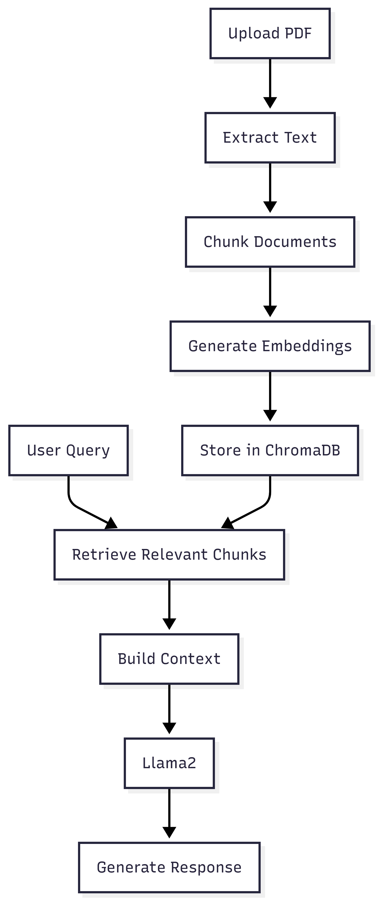
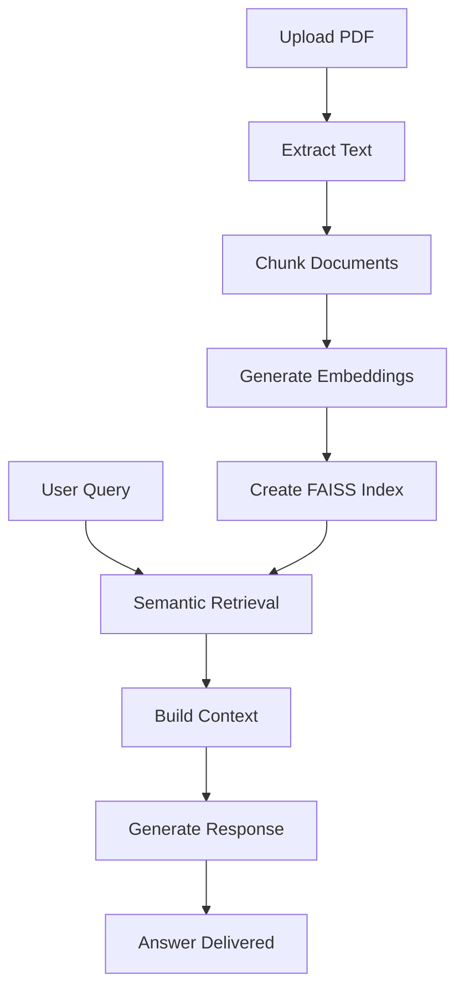
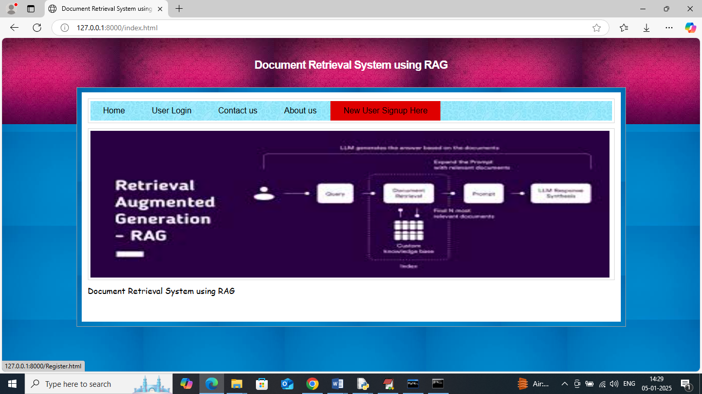
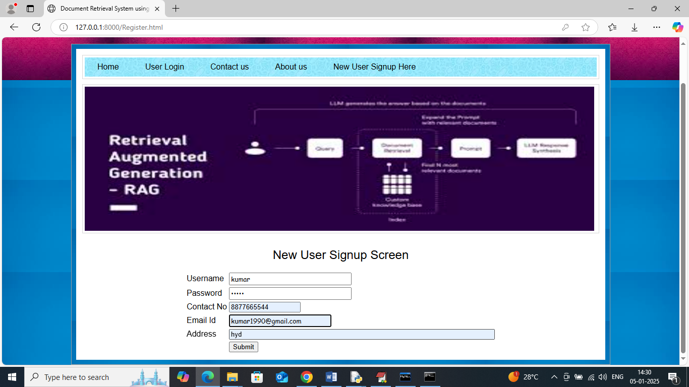
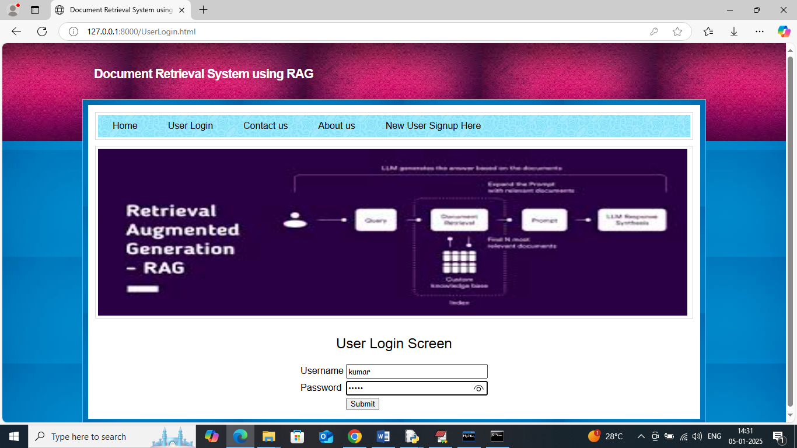
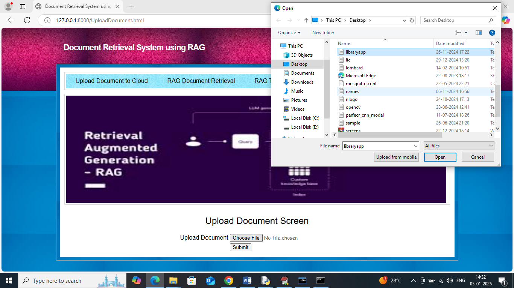
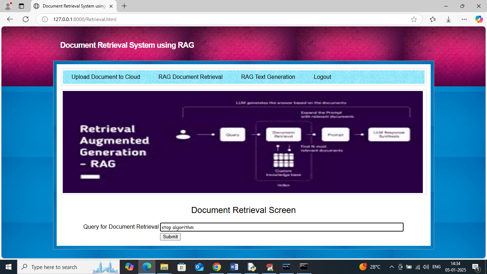
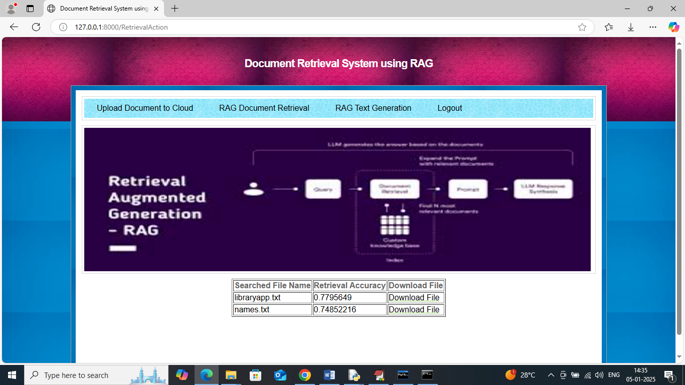
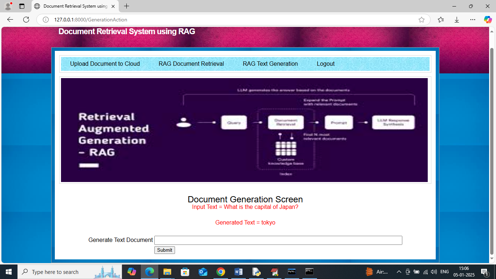

# 🚀 KnowledgeForge AI

<p align="center">
  
</p>

<h1 align="center">KnowledgeForge AI</h1>

<p align="center">
Enterprise Retrieval-Augmented Generation (RAG) Platform
</p>

<p align="center">


</p>

<p align="center">
Turn enterprise documents into an intelligent AI-powered knowledge system using semantic search, vector retrieval, and Large Language Models.
</p>

---

## 🌐 Live Demo

### Try the Application

🔗 **Live Website**

https://knowledgeforge-ai-en-h0ed.bolt.host/

### Video Walkthrough

🎥 https://youtu.be/8qpm6ZLCjfE

---

# 📖 About The Project

KnowledgeForge AI is a Retrieval-Augmented Generation (RAG) platform that enables organizations to search, retrieve, and interact with knowledge stored inside documents using natural language.

Instead of relying on traditional keyword-based search, the platform understands context and meaning through semantic embeddings and vector similarity search.

Users can upload PDF documents, build a searchable knowledge base, and receive AI-generated answers grounded in the uploaded content.

---

# ✨ Core Capabilities

### Intelligent Document Processing

* PDF Upload & Parsing
* Automatic Text Extraction
* Smart Document Chunking
* Knowledge Base Creation

### Semantic Search Engine

* Transformer-Based Embeddings
* Vector Similarity Search
* FAISS Indexing
* Context Retrieval Pipeline

### AI Answer Generation

* Retrieval-Augmented Generation (RAG)
* Context-Aware Responses
* Hallucination Reduction
* Source-Grounded Answers

### Enterprise Features

* User Authentication
* Knowledge Management
* Secure Document Access
* Scalable Retrieval Architecture

---

# 🎯 Problem Statement

Organizations generate large amounts of unstructured information:

* Technical Documentation
* Research Papers
* Internal Wikis
* Product Manuals
* SOP Documents
* Compliance Policies

Finding relevant information inside these documents is often slow and inefficient.

KnowledgeForge AI solves this challenge by combining:

✅ Semantic Understanding

✅ Vector Search

✅ Context Retrieval

✅ Large Language Models

✅ Enterprise Knowledge Discovery

---

# 🏗 System Architecture

<p align="center">
  
</p>

The platform follows a modular Retrieval-Augmented Generation architecture:

### 1. Document Ingestion Layer

Handles document uploads and preprocessing.

### 2. Embedding Layer

Generates dense vector representations using transformer models.

### 3. Vector Database Layer

Stores embeddings inside a FAISS index for efficient retrieval.

### 4. Retrieval Layer

Finds the most relevant document chunks using similarity search.

### 5. Context Builder

Constructs prompts from retrieved knowledge.

### 6. LLM Layer

Generates human-readable responses grounded in retrieved context.

---

# 🔄 Workflow

<p align="center">
  
</p>



---

# 🛠 Technology Stack

| Category        | Technology            |
| --------------- | --------------------- |
| Frontend        | HTML, CSS             |
| Backend         | Django                |
| Language        | Python                |
| NLP             | Transformers          |
| Embeddings      | Sentence Transformers |
| Vector Search   | FAISS                 |
| Deep Learning   | PyTorch               |
| Database        | MySQL                 |
| Cloud Services  | AWS (Boto3)           |
| Data Processing | NumPy                 |

---

# 📂 Project Structure

```bash
KnowledgeForge-AI
│
├── Rag/
├── RagApp/
├── assets/
├── screenshots/
├── docs/
│
├── manage.py
├── requirements.txt
├── README.md
└── LICENSE
```

---

# 📸 Application Screenshots

## Landing Page



---

## Dashboard



---

## Authentication



---

## Document Upload



---

## Semantic Search



---

## Retrieval Results



---

## Query Processing


---

## AI Generated Response



---

# ⚙️ Installation

```bash
# Clone repository

git clone https://github.com/Ashrith-3108/KnowledgeForge-AI.git

# Move into project

cd KnowledgeForge-AI

# Create virtual environment

python -m venv venv

# Activate environment

# Windows

venv\Scripts\activate

# Install dependencies

pip install -r requirements.txt

# Run migrations

python manage.py migrate

# Start server

python manage.py runserver
```

Application:

```bash
http://127.0.0.1:8000
```

---

# 📈 Future Enhancements

### Upcoming Features

* Multi-User Workspaces
* Role-Based Access Control
* REST APIs
* Docker Deployment
* Kubernetes Support
* CI/CD Pipelines
* Monitoring & Observability
* Multi-Agent RAG
* Knowledge Graph Integration
* Real-Time Streaming Ingestion

---

# 👨‍💻 Author

## Ashrith Vavillapally

AI Engineer • Data Engineer • Software Developer

### GitHub

https://github.com/Ashrith-3108

### LinkedIn

https://www.linkedin.com/in/vavillapally-ashrith-9823482a1/

### Email

[vavillapallyashrith@gmail.com](mailto:vavillapallyashrith@gmail.com)

---

# ⭐ Project Highlights

* Built an end-to-end Retrieval-Augmented Generation system
* Implemented semantic document search using FAISS
* Integrated transformer-based embeddings
* Developed scalable knowledge retrieval workflows
* Created AI-powered document question answering platform
* Designed enterprise-ready architecture for future expansion

---

# 📜 License

Licensed under the MIT License.

---

<p align="center">
Built with ❤️ using Django, FAISS, Transformers and Retrieval-Augmented Generation
</p>
